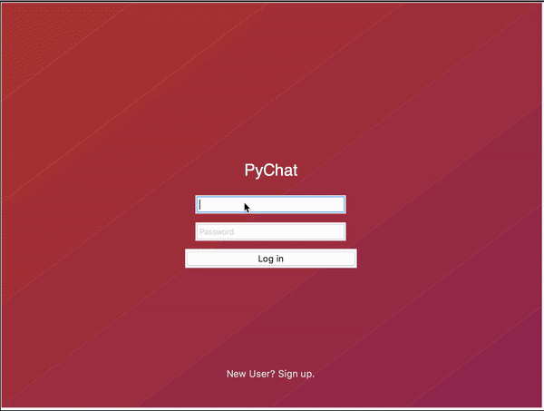

# PyChat

Chat application



### Prerequisites

What things you need to install the software and how to install them

```
Python3 - www.python.org
```
### USAGE

```
Run all the python files at the same time!
```


## Authors

* **Srikumar Sastry** - [Vishu26](https://github.com/Vishu26)

## License

This project is licensed under the MIT License - see the [LICENSE.md](LICENSE.md) file for details
